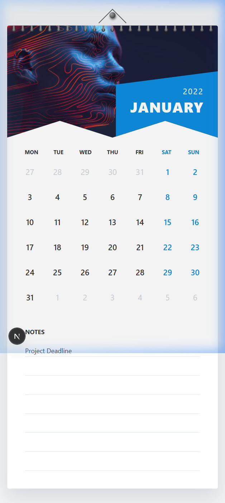

# Wall Calendar Component

<div align="center">
  
</div>

An interactive, responsive Wall Calendar component built with Next.js and Vanilla CSS. This project was built to translate a physical wall-calendar aesthetic into a functional digital component.

## ✨ Features

- **Wall Calendar Aesthetic:** Custom CSS architecture carefully models a real physical calendar, utilizing diagonal geometric clip-paths, top-anchored spiral binders, and a pseudo-element hanging nail.
- **Day Range Selector:** Users can seamlessly click to select start and end dates. The component visually tracks boundaries with specific highlighted states.
- **Persistent Notes Area:** An integrated 7-line memo pad that instantly saves entries to your browser's `localStorage`, retaining information across page reloads.
- **Responsiveness Guarantee:** A pristine mobile layout leveraging CSS media queries that transitions the hero image and perfectly stacks the calendar and notes section for touch devices.

## 🛠 Technology & Architecture Choices

- **Framework:** Next.js (React) to take advantage of component isolation and efficient rendering.
- **Styling:** Strictly Vanilla CSS Variables (`globals.css`) structured with **CSS Modules**. No external frameworks like Tailwind were used, maximizing bespoke design accuracy and reducing bundle bloat.
- **State Management:** Native React Hooks (`useState`, `useEffect`) manage range state, while client-side DOM syncs cleanly with standard Web Storage API (`localStorage`).

## 🚀 Running Locally

1. **Install Dependencies:**
   ```bash
   npm install
   ```

2. **Start the Development Server:**
   ```bash
   npm run dev
   ```

3. **Verify:** Open your browser and navigate to `http://localhost:3000` to view the application.

## 🌍 Deploying to Vercel

Since this project leverages standard Next.js building semantics, it is optimized for Vercel out of the box.

1. Push your repository to GitHub, GitLab, or Bitbucket.
2. Visit [Vercel](https://vercel.com/new).
3. Select your repository and click **Deploy**. Vercel will auto-detect Next.js and apply the correct build settings (`npm run build`).
